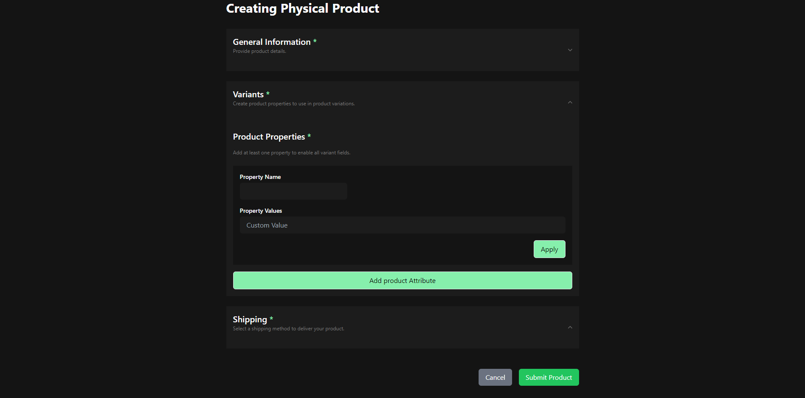

# Product Creation Form

This project is a React application that allows users to create and manage physical products. It utilizes Redux for state management and provides a user-friendly interface for inputting product details, variants, media, and shipping information.



## Features

- **General Information**: Input product title, description, and collection ID.
- **Variants**: Create and manage product variants with customizable properties.
- **Media Upload**: Upload images for the product.
- **Shipping Options**: Select a shipping method for the product.
- **State Management**: Uses Redux for managing application state.

## Technologies Used

- React
- Redux Toolkit
- TypeScript
- Tailwind CSS

## Installation

1. Clone the repository:

   ```bash
   git clone https://github.com/yourusername/product-creation-form.git
   cd product-creation-form
   ```

2. Install dependencies:

   ```bash
   npm install
   ```

3. Start the development server:

   ```bash
   npm run dev
   ```

4. Open your browser and navigate to `http://localhost:3000`.

## Usage

- Fill in the product details in the "General Information" section.
- Add product variants in the "Variants" section.
- Upload product images in the "Product Images" section.
- Select a shipping method in the "Shipping" section.
- Click "Submit Product" to save the product information.
